<!-- Tech Console · Bryan Zhang (DuoYu) -->

## Bryan Zhang (DuoYu)
**Cyber Operations · AI Systems · Digital Forensics**  
Tucson, AZ · University of Arizona  

“Code is not just logic — it’s a record of who you were when you wrote it.”

**System Status:**  

**Live Telemetry:**  

### 🧠 Focus Areas
- Threat detection & **digital forensics**  
- **AI-driven** cybersecurity analytics  
- GPU-accelerated data visualization pipelines  
- Secure system architecture & automation  

### 📂 Key Projects
**🔸 [Cambridge-IGCSE-Computer-Science](https://github.com/cyberbryanzhang/Cambridge-IGCSE-Computer-Science)**  
Archive of early Python programs & algorithm exercises (EN/中文).  
Includes acknowledgment to **Mr. Mark Sprietsma** for mentorship and guidance.  

**🔸 [Raymond-on-your-Desktop](https://github.com/cyberbryanzhang/Raymond-on-your-Desktop)**  
A local AI companion focused on reflective learning, emotional grounding, and productivity.

---

### ⚡ Stack
`Python` · `CUDA` · `Bash` · `Pandas` · `Scikit-learn` · `Wireshark` · `Linux` · `Git` · `Jupyter`

---

### 📡 Telemetry

  
  

  
<b>More telemetry (auto-updated)</b>

   
  

    
  

---

📧 <a href="mailto:cyber.bryanzhang@gmail.com">cyber.bryanzhang@gmail.com</a> ·
<a href="https://www.linkedin.com/in/bryanzdy">LinkedIn</a> ·
<a href="https://github.com/cyberbryanzhang">GitHub</a>

  
